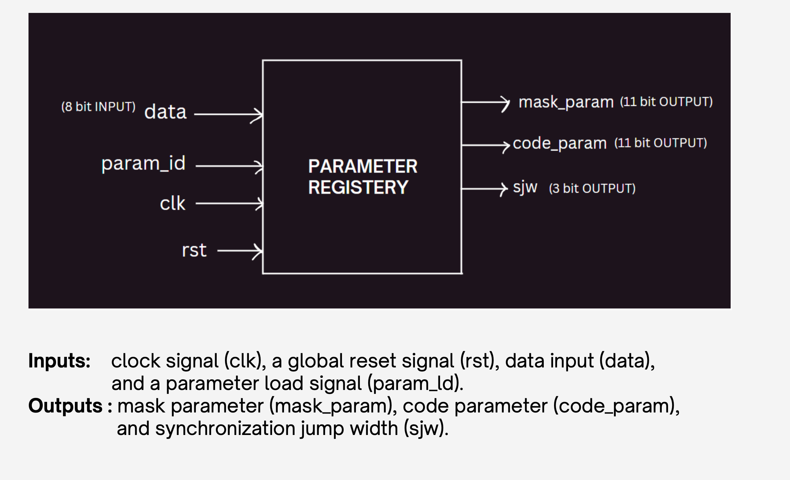
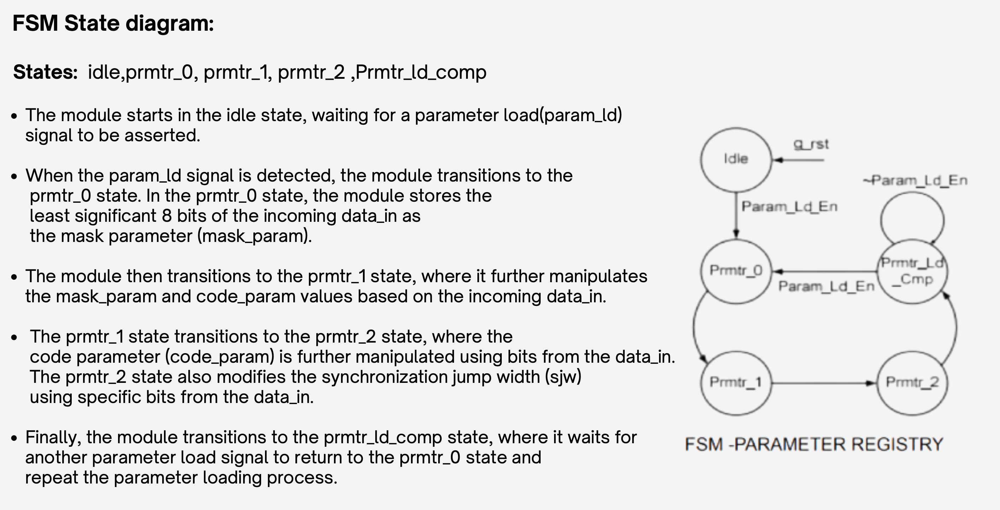

# Parameter-Registry-Block
module that stores and manages parameters for other modules. It provides a central location for defining and accessing parameters, making it easier to reuse and configure modules.

# Parameter Registry Block

## Introduction
A parameter registry block is a module that stores and manages parameters for other modules. It provides a central location for defining and accessing parameters, making it easier to reuse and configure modules.

Parameter registry blocks are typically used to store parameters that are common to multiple modules, such as register widths, data types, and clock frequencies.

Parameter registry blocks are typically implemented using generate statements, which allow for the creation of dynamic structures based on parameter values. This makes it possible to define modules that can be configured with a wide range of parameters without having to write separate modules for each possible configuration.

The registry block implements a finite state machine (FSM) model for managing parameter loading and manipulation based on input data.

---

## Block Diagram

---

## FSM State Diagram

---

## Outputs at Each State of the FSM

### `idle`:
- Initial state where all outputs (`mask_param`, `code_param`, `sjw`) are set to zero.
- No parameter manipulation.
- Serves as the starting point of the FSM and the state where the FSM returns after completing a parameter loading cycle.

### `prmtr_0`:
- Stores the least significant 8 bits of data as `mask_param`. The remaining MSB bits are concatenated with zeros.
- `code_param` and `sjw` outputs retain their values from the `idle` state.

### `prmtr_1`:
- Modifies the 8-bit `mask_param` using bits [2:0] of data (`mask_param =data_reg[2:0]+mask_param[7:0]`).
- Stores bits [7:3] of data as the least significant 5 bits of `code_param`. The remaining MSB bits are concatenated with zeros.
- `sjw` output remains unchanged.

### `prmtr_2`:
- Stores the least significant 6 bits of data as the MSB 6 bits of `code_param`. The remaining 5 bits of `code_param` remain the same in the LSB bits.
- Uses bits [7:6] of data to set the `sjw` output. `mask_param` output remains unchanged.

### `prmtr_ld_comp`:
- Maintains the outputs (`mask_param`, `code_param`, `sjw`) from the previous state (`prmtr_2`).
- FSM waits in this state until the parameter load signal (`param_ld`) becomes active again.
- Upon receiving the signal, transitions back to the `prmtr_0` state to initiate a new parameter loading cycle.

---

## Initialization and Reset
Upon a global reset (`reset`), the module sets its internal registers to initial values, and output parameters (`mask_param`, `code_param`, `sjw`) are reset to zero.

The FSM state is also reset to the `idle` state on global reset.

